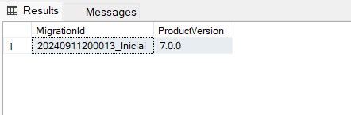

# WebAPI
1. [Introducción](#introducción)
2. [¿Qué es una API?](#qué-es-una-api)
3. [ASP.NET Core MVC](#aspnet-core-mvc)
4. [Relación entre clases](#relación-entre-clases)
5. [Entity Framework Core](#entity-framework-core)
6. [LinQ](#linq)
7. [Asincronismo](#asincronismo)
8. [Acoplamiento](#acoplamiento)
9. [Inversión de control a inyección de dependencias](#inversión-de-control-a-inyección-de-dependencias)
10. [Delegados](#delegados)
11. [Middleware de ASP.NET Core](#middleware-de-ASP.NET-Core)
12. [Filter](#filter)
13. [Data Transfer Object (DTO)](#data-transfer-object-dto)
14. [Pruebas unitarias](#Pruebas-de-software)
15. [Seguridad](#seguridad)

## Introducción

### ¿Qué es la programación orientada a objetos (POO)?
Es un paradigma de programación. En el que los objetos se utilizan como metáfora para
representar las entidades reales de lo que queremos modelar. 
Una clase representa una "plantilla" o "molde" y el objeto es un ejemplar de esa plantilla. Tiene las siguientes bases o conceptos:

- Abstracción
- Encapsulación
- Modularización
- Jerarquización

### Abstracción
Es el proceso de extracción de las características esenciales de algo (lo que queremos modelar), ignorando los detalles superficiales. 
Diferentes posibles abstracciones para un coche:

| Alquilado  | Particular | Flete    |
|------------|------------|----------|
| Tarifa     | Consumo          | Consumo   |
| Limite kms | Color            | Carga soportada   |
| Consumo    | Valor de reventa | Garantía   |
|            | Durabilidad      |            |

### Encapsulación
Es el proceso en el cual se ocultan los detalles del soporte de las características de una
abstracción. 
No se trata de ocultar las características en sí, sino de no mostrar cómo guardo o maneja
internamente esas características. 
Por ej, de la clase fecha nos interesa obtener el día, mes y año. Y no como esta guardado internamente.

### Modularización
Es el proceso de descomposición de un sistema en un conjunto de módulos o piezas.
Que esten poco acopladas (independientes) y cohesivas (con significado propio). 
Se entiende por sistema al conjunto de piezas que colaboran entre sí.
Por ej, el módulo de cierre centralizado con el módulo de la alarma del auto.

### Jerarquización
Es el proceso de estructuración por el que se produce una organización de un conjunto de
elementos en niveles de responsabilidad. 

### Elementos de la POO
- Clase: descripción de los datos y de las operaciones de un elemento modelado.
- Objeto: instancia de una clase, ejemplar concreto.
- Mensaje: invocación de una operación sobre un objeto.
- Método: definición de una operación de una clase.
- Atributo: los datos de una clase, y por tanto, presente en todos los objetos de esa clase.
- Estado: conjunto de los valores de los atributos que tiene un objeto.

Una clase, es la definición de los atributos y métodos que describen el comportamiento
de un objeto. 
Un objeto, es un ejemplar concreto de una clase que responde a los mensajes
correspondientes a sus métodos, adecuándose al estado de sus atributos. 

[Documentación](https://learn.microsoft.com/es-es/dotnet/csharp/fundamentals/tutorials/oop)

### Palabras claves
Son identificadores reservados predefinidos que tienen significados especiales para el
compilador. 
Estos no se pueden utilizar como identificadores en nuestro programa. 
Algunos ejemplos:
- abstract
- break
- continue

[Documentación](https://docs.microsoft.com/en-us/dotnet/csharp/language-reference/keywords/)

### Modificadores de visibilidad
Todos los tipos y miembros de tipo (clase, método, atributo) tienen un nivel de accesibilidad.
Controla si se pueden usar desde otro código en su ensamblado o en otros ensamblados.
- public: puede ser accedido desde cualquier código.
- private: puede ser accedido desde la misma clase.
- internal: puede ser accedido desde el mismo ‘assembly’.

[Documentación](https://docs.microsoft.com/en-us/dotnet/csharp/programming-guide/classes-and-structs/access-modifiers)

### Sentencias de flujo de ejecución
Son aquellas sentencias que nos permiten manipular nuestro código. Que, dependiendo determinado criterio, nuestro flujo salte a una u otra línea.
- if
- switch
- for
- foreach
- while
- do while
- try-catch

### Arquitectura Model-View-Controller
Se utiliza para desacoplar la interfaz de usuario (vista), los datos (modelo) y la lógica de la
aplicación (controlador). 
Separa una aplicación en tres grupos de componentes principales: modelos, vistas y
controladores. 
Permite lograr la separación de intereses. 
Las solicitudes del usuario se enrutan a un controlador que se encarga de trabajar con el
modelo para realizar las acciones del usuario o recuperar los resultados de consultas. 
El controlador elige la vista para mostrar al usuario y proporciona cualquier dato de modelo
que sea necesario. 
Se entiende por vista un HTML o un JSON con información.

 
 

## ¿Qué es una API?

### Application Programming Interface
Es una interfaz que permite la comunicación entre 2 aplicaciones.
Podemos decir que es un sitio que en vez de responder algo visual, como HTML y CSS, nos responde información. 
Los usuarios probablemente no van a ingresar a este tipo de sitios, pero sí una aplicación que necesite abastecerse de cierta información.
Por ejemplo, una aplicación que necesite un listado completo de todos los países del mundo
podría consumir una API que le otorgue esa información.

Otra importancia de los APIs a nivel general, es que permite realizar abstracciones. La idea de una abstracción es que nos permite facilitar el uso de un software sin necesitar conocer cómo funciona internamente, basta con utilizar las funciones que el Api expone.

### ¿Qué es HTTP?
Es un protocolo de transferencia de hipertexto (Hypertext Transfer Protocol) es el protocolo de comunicación que permite las transferencias de información a través de archivos (XML, HTML…) en la World Wide Web. 
HTTP define la sintaxis y la semántica que utilizan los elementos de software de la arquitectura web para comunicarse.

HTTP es un protocolo sin estado, por lo que no guarda ninguna información sobre conexiones anteriores.

Es un protocolo orientado a transacciones y sigue el esquema petición-respuesta entre un cliente y un servidor. El cliente realiza una petición enviando un mensaje (request), con cierto formato al servidor. El servidor le envía un mensaje de respuesta (response).

#### Métodos HTTP
Los métodos son usados para manipular los diferentes recursos que conforman una API. 
Los principales métodos soportados por HTTP son:
- POST: crear un recurso nuevo.
- PUT: modificar un recurso existente.
- GET: consultar información de un recurso.
- DELETE: eliminar un recurso determinado.
- PATCH: modificar solamente un atributo de un recurso.

Con estos métodos (o acciones) podemos realizar el CRUD (Create, Read, Update, Delete) de una entidad.

Estos métodos, junto con la URI, nos proporciona una interfaz uniforme que nos permite la transferencia de datos aplicando operaciones concretas sobre un recurso determinado. 
Aunque la mayoría de las operaciones que componen una API REST podrían llevarse a cabo mediante métodos GET y POST, el abuso de ellos para operaciones que nada tienen que ver con el propósito con el que se concibieron, puede provocar un mal uso.

#### Respuestas HTTP
Los códigos de estado de respuesta HTTP indican si se ha completado satisfactoriamente una solicitud HTTP específica.
 Las respuestas se agrupan en cinco clases:

- Respuestas informativas (100–199)
- Respuestas satisfactorias (200–299)
- Redirecciones (300–399)
- Errores de los clientes (400–499)
- Errores de los servidores (500–599)

[Documentación](https://developer.mozilla.org/es/docs/Web/HTTP/Status)

### REpresentational State Transfer (REST)
Es un tipo de arquitectura de desarrollo web que se apoya totalmente en el estándar HTTP. 
Proporciona un fuerte aislamiento con quien la consume. 
Los objetos REST son manipulados a través de una URI (Uniform Resource Identifier). 
Esta URI (endpoint) hace de identificador único de cada recurso del sistema REST, por lo que no puede ser compartida por más de un recurso.

La estructura básica de una URI es la siguiente: 
- {protocolo}://{hostname}:{puerto}/{ruta del recurso}?{parámetros de filtrado (opcional)}

El nombre de la URI no debe contener palabras que impliquen acciones, por lo que deben
evitarse los verbos en su construcción. 
Además, las URI siguen una jerarquía lógica de capas que permite ordenar los recursos y
englobar las distintas funcionalidades entre sí.

Un endpoint es un puerto de comunicaciones empleado para realizar llamadas a procedimientos remotos. Podemos decir que los endpoints son las URL's que reciben o retornan información de un Web API.

QueryParams: https://localhost:7054/WeatherForecast/Name?name=Freezing&city=bsas  
PathParams https://localhost:7054/WeatherForecast/Freezing/bsas

### RESTFul

#### Arquitectura cliente-servidor
Habla de la separación entre un cliente y un proveedor o servidor. El cliente puede ser cualquier software capaz de comunicarse utilizando el protocolo HTTP con el servidor web. 
Con este principio aseguramos la separación de responsabilidades entre nuestros servicios Web y los clientes que consumen dicho servicio.

#### Interfaz uniforme
El objetivo es tener una forma estandarizada de transmisión de la información. Con esta condición tenemos una manera universal de utilizar web APIs comunes, es decir, si sabes consumir un Web API, se pueden consumir otros APIs sin mucha dificultad. 
Para cumplir con la condición de interfaz uniforme, hay que cumplir con cuatro subcondiciones.

- GET: http://web.com/car -> devuelve todos los autos
- GET: http://web.com/car/nhz493 -> devuelve el auto con patente 'nhz493'
- POST: http://web.com/car -> crea un nuevo auto con la información enviada en la petición
- DELETE: http://web.com/car/nhz493 -> elimina el auto con patente 'nhz493'
- PUT: http://web.com/car/nhz493 - actualiza el auto con patente 'nhz493' según la información enviada en la petición

#### Protocolos sin estado
Cada una de las peticiones realizadas al web API tienen toda la información necesaria para que la petición sea resuelta de manera satisfactoria. Sí el web API requiere que el cliente esté debidamente identificado para acceder y manipular un recurso entonces el cliente debe de enviarnos algún tipo de información que identifique al cliente que está haciendo la petición cada vez que se haga una petición HTTP al servidor.

#### Caché
Las respuestas del Web API deben indicar cuándo se deben guardar en caché, es decir nos referimos a que el cliente puede guardar el recurso dado por la URL de manera local en su dispositivo, para que en subsiguientes peticiones HTTP dichos recursos no tengan que ser pedidos nuevamente al
Web API, sino que se pueda consumir la versión local.

#### Sistema en capas
El servicio del servidor debe tener una arquitectura de capas donde su evolución sea completamente transparente para el cliente. 
Por ej, si el servicio web va a utilizar un balanceo de carga, los clientes no tienen por qué tener presente ese detalle pues esto debe ser algo completamente transparente para ellos.

 
 

## ASP.NET Core MVC
Es un marco web de código abierto, creado por Microsoft, para crear servicios y aplicaciones web .NET. Es multiplataforma y se ejecuta en Windows, Linux, macOS, y Docker.

[Documentación](https://learn.microsoft.com/es-es/aspnet/core/mvc/overview?view=aspnetcore-8.0&WT.mc_id=dotnet-35129-website)

 
 

## Relación entre clases
Si dos objetos colaboran, a través del paso de mensajes, sus respectivas clases están relacionadas.

### Relación de Composición/Agregación

Es la relación que se constituye entre el todo y la parte. Se puede determinar que existe una relación de composición entre la clase A (el todo) y la clase B (la parte), si un objeto de la clase A “tiene un” objeto de la clase B.

La relación de composición no abarca simplemente cuestiones físicas (libro y páginas), como “contiene un” (aparato digestivo y bolo alimenticio).  
Sino también, a relaciones lógicas que respondan adecuadamente al todo y a la parte
como “posee un” (propietario y propiedades).

#### Composición
- Es una composición donde la vida del objetos de la clase contenida debe coincidir con la vida de la clase contenedor.
- Los componentes constituyen una parte del objeto compuesto.
- La supresión del objeto compuesto conlleva la supresión de los componentes.
- Los componentes no pueden ser compartidos por varios objetos compuestos.
- Composición fuerte

Clases persona y cabeza: una cabeza solo puede pertenecer a una persona y no puede existir una cabeza sin su persona.

    class Todo {
        private Parte parte;

        public Todo(){
            this.parte = new Parte();
        }
    }

    class Parte {
    }

#### Agregación
- Es una composición donde la vida del objetos de la clase contenida no debe coincidir con la vida de la clase contenedor.
- Los componentes constituyen opcionalmente una parte del objeto compuesto.
- La destrucción del compuesto no conlleva la destrucción de los componentes.
- Los componentes pueden ser compartidos por varios compuestos.
- Composición débil

Clases persona y familia: un persona puede pertenecer a la familia en que nació y a las que posteriormente formó y seguir vivo aunque ya no existan dichas familias.

    class Agregación {
        private List<Agregado> agregados;

        public Agregación(){
            this.agregados = new List<Agregado>();
        }

        public void Add(Agregado agregado){
            this.agregados.Add(agregado);
        }

        public void Remove(Agregado agregado){
            this.agregados.Remove(agregado);
        }
    }

    class Agregado {
    }

### Relación de Asociación
Es la relación que perdura entre un cliente y un servidor determinado.

Existe una relación de asociación entre la clase A, el cliente, y la clase B, el servidor, si un objeto de la clase A disfruta de los servicios de un objeto determinado de la clase B (mensajes lanzados) para llevar a cabo la responsabilidad del objeto de la clase A en diversos momentos creándose una dependencia del objeto servidor.

    class Asociación {
        private Asociado asociado;

        public Asociación(Asociado asociado){
            this.Set(asociado);
        }

        public void Set(Asociado asociado){
            this.asociado = asociado;
        }
    }

    class Asociado {
    }

### Relación de Dependencia/Uso
Es la relación que se establece momentáneamente entre un cliente y cualquier servidor.

Existe una relación de uso entre la clase A, el cliente, y la clase B, el servidor, si un objeto de la clase A disfruta de los servicios de un objeto de la clase B (mensajes lanzados) para llevar a cabo la responsabilidad del objeto de la clase A en un momento dado sin dependencias futuras.

    class Uso {

        public void Metodo(Usado parametro){
            parametro.HacerAlgo("unValor");
        }
    }

    class Usado {
    }

### Comparativa de Relaciones entre Clases por Colaboración

### Relaciones por transmisión entre clases
Si una clase transmite a otra todos sus miembros, atributos y métodos, para organizar una jerarquía de clasificación.

#### Relación de Herencia por Extensión
La clase descendiente implementa todas las operaciones de la clase base, añadiendo o redefiniendo partes especializadas

#### Relación de Herencia por Implementación
La especialización transforma el concepto de la clase base a la clase derivada

 
 

## Entity Framework Core
Entity Framework (EF) Core es una versión ligera, extensible, de código abierto y multiplataforma de la popular tecnología de acceso a datos Entity Framework.  
EF Core puede actuar como asignador relacional de objetos, que se encarga de lo siguiente:
- Permite a los desarrolladores de .NET trabajar con una base de datos usando objetos .NET.
- Permite prescindir de la mayor parte del código de acceso a datos que normalmente es necesario escribir.

EF Core es compatible con muchos motores de base de datos; vea Proveedores de bases de datos para más información.

### El modelo
Con EF Core, el acceso a datos se realiza mediante un modelo. Este se compone de clases de entidad y un objeto de contexto que representa una sesión con la base de datos. Este objeto de contexto permite consultar y guardar datos.

[Documentación](https://learn.microsoft.com/es-es/ef/core)

### DbContext
Al desarrollar con el flujo de trabajo Code First, se define un DbContext derivado que representa la sesión con la base de datos y expone un DbSet para cada tipo del modelo. En este tema se describen las distintas formas de definir las propiedades de DbSet.

El caso común que se muestra en los ejemplos de Code First es tener DbContext con propiedades DbSet automáticas públicas para los tipos de entidad del modelo.

    public class BloggingContext : DbContext
    {
        public DbSet<Blog> Blogs { get; set; }
        public DbSet<Post> Posts { get; set; }
    }

[Documentación](https://learn.microsoft.com/en-us/ef/core/dbcontext-configuration/)

### Consultas
Las instancias de las clases de entidad se recuperan de la base de datos por medio de Language Integrated Query (LINQ). 

    using (var db = new BloggingContext())
    {
        var blogs = db.Blogs
            .Where(b => b.Rating > 3)
            .OrderBy(b => b.Url)
            .ToList();
    }

### Guardado de datos

#### Enfoque 1: seguimiento de cambios y SaveChanges
Los datos se crean, se eliminan y se modifican en la base de datos mediante instancias de las clases de entidad. 
En muchos escenarios, el programa debe consultar algunos datos de la base de datos, realizar alguna modificación en ella y volver a guardar las modificaciones; esto a veces se conoce como "unidad de trabajo".

    using (var db = new BloggingContext())
    {
        var blog = new Blog { Url = "http://sample.com" };
        db.Blogs.Add(blog);
        db.SaveChanges();
    }

Lo anterior describe una operación de actualización típica de los datos existentes, pero los principios similares abogan por agregar y quitar entidades. Interactúe con el control de cambios de EF mediante una llamada a DbSet<TEntity>.Add y Remove, que supondrá el seguimiento de los cambios. A continuación, EF aplica todos los cambios realizados en la base de datos cuando se llama a SaveChanges() (por ejemplo, a través de SQL INSERT y DELETE cuando se usa una base de datos relacional).

#### Enfoque 2: ExecuteUpdate y ExecuteDelete ("actualización masiva")
Aunque el seguimiento de cambios y SaveChanges() son una manera eficaz de guardar los cambios, tienen ciertas desventajas.

En primer lugar, SaveChanges() requiere que consulte y realice un seguimiento de todas las entidades que vayan a modificar o eliminar. Si necesita, por ejemplo, eliminar todos los blogs con clasificación por debajo de un umbral determinado, debe consultar, materializar y realizar el seguimiento de un número quizá enorme de filas y que SaveChanges() genere una instrucción DELETE para cada una de ellas. Las bases de datos relacionales proporcionan una alternativa mucho más eficaz: se puede enviar un solo comando DELETE, especificando las filas que se van a eliminar con una cláusula WHERE, pero el modelo SaveChanges() no permite generarlo.

    using (var db = new BloggingContext())
    {
        context.Blogs.Where(b => b.Rating < 3).ExecuteDelete();
    }

Esto permite expresar una instrucción SQL DELETE a través de operadores LINQ normales, como una consulta LINQ normal, lo que hace que se ejecute el siguiente código SQL en la base de datos:

    DELETE FROM [b]
    FROM [Blogs] AS [b]
    WHERE [b].[Rating] < 3

[Documentación](https://learn.microsoft.com/es-es/ef/core/saving)

### Creación y configuración de un modelo

#### Uso de la API fluida para configurar un modelo
Puede reemplazar el método OnModelCreating del contexto derivado y usar API fluida para configurar el modelo. Este es el método más eficaz de configuración y permite especificar la configuración sin modificar las clases de entidad. La configuración de API fluida tiene la prioridad más alta y reemplaza las anotaciones de datos y las convenciones.

    using Microsoft.EntityFrameworkCore;

    namespace EFModeling.EntityProperties.FluentAPI.Required;

    internal class MyContext : DbContext
    {
        public DbSet<Blog> Blogs { get; set; }

        #region Required
        protected override void OnModelCreating(ModelBuilder modelBuilder)
        {
            modelBuilder.Entity<Blog>()
                .Property(b => b.Url)
                .IsRequired();
        }
        #endregion
    }

    public class Blog
    {
        public int BlogId { get; set; }
        public string Url { get; set; }
    }

#### Uso de anotaciones de datos para configurar un modelo
También puede aplicar determinados atributos (conocidos como anotaciones de datos) a las clases y propiedades. Las anotaciones de datos reemplazarán a las convenciones, pero la configuración de la API fluida también las reemplazará.

[Documentación](https://learn.microsoft.com/es-es/ef/core/modeling)

### Migraciones
EF Core proporciona dos métodos principales para mantener sincronizados el esquema de la base de datos y el modelo de EF Core. Para elegir entre los dos, decida si es el modelo de EF Core o el esquema de la base de datos el origen de confianza.

- Si quiere que el modelo de EF Core sea el origen verdadero, use Migraciones. Al realizar cambios en el modelo de EF Core, este método aplica de forma incremental los cambios de esquema correspondientes a la base de datos para que siga siendo compatible con el modelo de EF Core.
- Si quiere que el esquema de la base de datos sea el origen verdadero, use Ingeniería inversa. Este método permite aplicar la técnica de scaffolding a un elemento DbContext y a las clases de tipo de entidad mediante la aplicación de ingeniería inversa al esquema de la base de datos de un modelo de EF Core.

En proyectos reales, los modelos de datos cambian a medida que se implementan características: se agregan o se quitan nuevas entidades o propiedades, y los esquemas de base de datos se deben cambiar según corresponda para mantenerlos sincronizados con la aplicación. La característica de migraciones de EF Core proporciona una manera de actualizar incrementalmente el esquema de la base de datos para mantenerla sincronizada con el modelo de datos de la aplicación al tiempo que se conservan los datos existentes en la base de datos.

A nivel general, las migraciones funcionan de esta forma:

Cuando se introduce un cambio en el modelo de datos:

     public class Club
    {
        public int Id { get; set; }
        public int Name { get; set; }
    }

el desarrollador usa herramientas de EF Core para agregar una migración correspondiente en la que se describan las actualizaciones necesarias para mantener sincronizado el esquema de la base de datos:

    Add-Migration Inicial

EF Core compara el modelo actual con una instantánea del modelo anterior para determinar las diferencias y genera los archivos de origen de la migración, de los que se puede realizar el seguimiento en el control de código fuente del proyecto como cualquier otro archivo de código fuente:

    public partial class Inicial : Migration
    {
        /// <inheritdoc />
        protected override void Up(MigrationBuilder migrationBuilder)
        {
            migrationBuilder.CreateTable(
                name: "Clubs",
                columns: table => new
                {
                    Id = table.Column<int>(type: "int", nullable: false)
                        .Annotation("SqlServer:Identity", "1, 1"),
                    Name = table.Column<int>(type: "int", nullable: false)
                },
                constraints: table =>
                {
                    table.PrimaryKey("PK_Clubs", x => x.Id);
                });
        }

        /// <inheritdoc />
        protected override void Down(MigrationBuilder migrationBuilder)
        {
            migrationBuilder.DropTable(
                name: "Clubs");
        }
    }

Una vez que se ha generado una migración nueva, haya varias maneras de aplicarla a una base de datos:

    Update-Database

EF Core registra todas las migraciones aplicadas en una tabla de historial especial, lo que le permite saber qué migraciones se han aplicado y cuáles no:

    SELECT * FROM [dbo].[_MigrationsHistory]

[Documentación](https://learn.microsoft.com/es-es/ef/core/managing-schemas/)

## LinQ (Language-Integrated Query)

### Métodos de extensión
Los métodos de extensión permiten "agregar" métodos a los tipos existentes sin crear un nuevo tipo derivado, recompilar o modificar de otra manera el tipo original. Los métodos de extensión son métodos estáticos, pero se les llama como si fueran métodos de instancia en el tipo extendido.

    public static class ExtensionsMethods
    {
        public static string AddFullStop(this string text)
        {
            return text + ".";
        }
    }

Algunas consideraciones:
- El método debe ser estático.
- Debe estar contenido en una clase estática.
- Debe contener un primer parámetro obligatorio que comienza con la palabra reservada 'this'. Con esto indicamos que el método aplica a ese tipo.

[Documentación](https://learn.microsoft.com/es-es/dotnet/csharp/programming-guide/classes-and-structs/extension-methods)

### Consultas por métodos de extensión
Para la mayoría de las consultas simples podemos utilizar los métodos de extensión que se encuentran en el namespace System.Linq:

    Where(Expression<Func<TSource, bool>> predicate)
    OrderBy(Expression<Func<TSource, TKey>> keySelector)
    OrderDescendingBy(Expression<Func<TSource, TKey>> keySelector)
    Take(int count)
    First()
    First(Expression<Func<TSource, bool>> predicate)
    FirstOrDefault()
    FirstOrDefault(Expression<Func<TSource, bool>> predicate)
    Last()
    Last(Expression<Func<TSource, bool>> predicate)
    LastOrDefault()
    LastOrDefault(Expression<Func<TSource, bool>> predicate)

Hasta incluso, si deseamos hacer consultas que involucren a mas de una entidad (lo que sería un JOIN en SQL) podemos utilizar el método Include():

    public async Task<List<Standing>> GetAsync(int id)
    {
        using (var context = new ApplicationDbContext(this._options))
        {
            return await context.Standings
                .Include(x => x.Club)
                .Where(x => x.TournamentId == id)
                .ToListAsync();
        }
    }

    SELECT [s].[TournamentId], [s].[ClubId], [s].[Draw], [s].[Loss], [s].[Win], [c].[Id], [c].[Address], [c].[Birthday], [c].[City], [c].[Email], [c].[Name], [c].[NumberOfPartners], [c].[Phone], [c].[StadiumName]
    FROM [dbo].[Standings] AS [s]
        INNER JOIN [dbo].[Clubs] AS [c] ON [s].[ClubId] = [c].[Id]
    WHERE [s].[TournamentId] = @__id_0

### LinQ
Es un conjunto de tecnologías basadas en la integración de capacidades de consulta directamente en el lenguaje C#. Tradicionalmente, las consultas con datos se expresaban como cadenas simples sin comprobación de tipos en tiempo de compilación ni compatibilidad con IntelliSense.
Una consulta es una expresión que recupera datos de un origen de datos. Los distintos orígenes de datos tienen diferentes lenguajes de consulta nativos, por ejemplo SQL para bases de datos relacionales y XQuery para XML.
LINQ simplifica esta situación al ofrecer un modelo de lenguaje C# coherente para tipos de orígenes de datos y formatos. En una consulta LINQ, siempre se trabaja con objetos de C#.

La parte más visible de "lenguaje integrado" de LINQ es la expresión de consulta. Las expresiones de consulta se escriben con una sintaxis de consulta declarativa. Con la sintaxis de consulta, puede realizar operaciones de filtrado, ordenación y agrupamiento en orígenes de datos con el mínimo código.

    int[] scores = { 97, 92, 81, 60 };

    IEnumerable<int> scoreQuery =
        from score in scores
        where score > 80
        select score;

    foreach (int i in scoreQuery)
    {
        Console.Write(i + " ");
    }

    // Output: 97 92 81

## Asincronismo

- Definición de sincronismo según RAE: Dicho de un proceso o de su efecto: Que se desarrolla en perfecta correspondencia temporal con otro proceso o causa. 
- Definición de asincronismo según RAE: Que carece de sincornismo. 
- Definición de simultáneo según RAE: Dicho de una cosa: Que se hace u ocurre al mismo tiempo que otra.

### ¿Qué es la Programación Sincrónica?
Es una técnica que se utiliza para que las computadoras realicen tareas paso a paso, en el orden en que se les dan las instrucciones.

La computadora completará cada tarea antes de pasar a la siguiente. Esto hace que sea fácil de entender y de predecir lo que la computadora hará en cualquier momento dado.

Sin embargo, la programación sincrónica puede ser problemática en ciertas situaciones, especialmente cuando se trata de tareas que requieren una cantidad significativa de tiempo para completarse.

Por ejemplo, supongamos que un programa sincrónico realiza una tarea que requiere esperar una respuesta de un servidor remoto. El programa quedará a la espera de la respuesta y no podrá hacer nada más hasta que se devuelva la respuesta. Esto se conoce como bloqueo y puede hacer que una aplicación no responda o aparezca como "congelada" para el usuario.

### ¿Qué es la Programación Asincrónica?
Es una forma en que un programa de computadora gestiona múltiples tareas simultáneamente en lugar de ejecutarlas una tras otra.

La programación asíncrona permite que un programa continúe trabajando en otras tareas mientras espera que ocurran eventos externos, como solicitudes de red. Este enfoque puede mejorar enormemente el rendimiento y la capacidad de respuesta de un programa.

Por ejemplo, mientras un programa recupera los datos de un servidor remoto, puede seguir ejecutando otras tareas como responder a las entradas del usuario.

[Documentación](https://learn.microsoft.com/es-es/dotnet/csharp/asynchronous-programming/)

### Task, await, async
Si tiene cualquier necesidad ligada a E/S (por ejemplo, solicitar datos de una red, acceder a una base de datos o leer y escribir un sistema de archivos), deberá usar la programación asincrónica. También podría tener código ligado a la CPU, como realizar un cálculo costoso, que también es un buen escenario para escribir código asincrónico.

C# tiene un modelo de programación asincrónico de nivel de lenguaje que permite escribir fácilmente código asincrónico sin tener que hacer malabares con las devoluciones de llamada o ajustarse a una biblioteca que admita la asincronía. Sigue lo que se conoce como el modelo asincrónico basado en tareas (TAP).

El núcleo de la programación asincrónica son los objetos Task y Task\<T>, que modelan las operaciones asincrónicas. Son compatibles con las palabras clave async y await. El modelo es bastante sencillo en la mayoría de los casos:

- Para el código ligado a E/S, espera una operación que devuelva Task o Task\<T> dentro de un método async.
- Para el código ligado a la CPU, espera una operación que se inicia en un subproceso en segundo plano con el método Task.Run.

La palabra clave await es donde ocurre la magia. Genera control para el autor de la llamada del método que ha realizado await, y permite en última instancia una interfaz de usuario con capacidad de respuesta o un servicio flexible.

### Piezas clave que debe comprender
- El código asincrónico puede usarse para código tanto ligado a E/S como ligado a la CPU, pero de forma distinta en cada escenario.
- El código asincrónico usa Task y Task\<T>, que son construcciones que se usan para modelar el trabajo que se realiza en segundo plano.
- La palabra clave async convierte un método en un método asincrónico, lo que permite usar la palabra clave await en su cuerpo.
- Cuando se aplica la palabra clave await, se suspende el método de llamada y se cede el control al autor de la llamada hasta que se completa la tarea esperada.
- await solo puede usarse dentro de un método asincrónico.

### Reconocer el trabajo ligado a la CPU y el ligado a E/S
Resulta fundamental que pueda identificar si el trabajo que debe realizar está ligado a E/S o a la CPU, ya que esto puede afectar en gran medida al rendimiento del código y podría dar lugar al uso inadecuado de ciertas construcciones.

A continuación, se indican dos preguntas que debe hacerse antes de escribir el código:

- ¿Estará su código "esperando" algo, como datos de una base de datos?

  - Si la respuesta es "sí", su trabajo está enlazado a E/S.

- ¿Realizará el código un cálculo costoso?

    - Si la respuesta es "sí", su trabajo está enlazado a la CPU.

Si el trabajo que tiene está ligado a E/S, use async y await sin Task.Run.

Si el trabajo que tiene está ligado a la CPU y le interesa la capacidad de respuesta, use async y await, pero genere el trabajo en otro subproceso con Task.Run. Si el trabajo es adecuado para la simultaneidad y el paralelismo, también debe plantearse el uso de la biblioteca TPL.

## Acoplamiento
Es una medida de la fuerza que un elemento está conectado a otros elementos. Estos elementos incluyen sistemas, paquetes, clases y métodos.

Acoplamiento bajo: no es dependiente de muchos elementos. 
Nos aporta:
- Fluidez: porque es fácil de comprender
- Flexible: porque es fácil de modificar
- Reusable: porque es fácil de reutilizar
- Robusta: porque no está constantemente afectada por el cambio

Alto acoplamiento: es el acoplamiento a elementos que son inestables en alguna dimensión, como su interfaz, su implementación, o su mera presencia.

Con elementos estables y generalizados rara vez es un problema. El alto acoplamiento per se no es el problema.

## Inversión de control a inyección de dependencias
La inversión de control es un principio de programación que invierte el flujo de control en una aplicación. En la programación orientada a procesos tradicional, el código que controla la ejecución del programa (la función principal) crea instancias de clases, llama a métodos e incluso solicita información al usuario para que la ejecución pueda continuar y el programa pueda realizar su tarea. IoC es un marco que crea instancias, llama a métodos y desencadena acciones del usuario, teniendo control total del flujo y eliminando esta responsabilidad de la función principal y, en consecuencia, de la aplicación.

La inyección de dependencias (DI) es una técnica de diseño de software en la que la creación y vinculación de dependencias se realiza fuera de la clase dependiente. Posteriormente dichas dependencias se proporcionan ya instanciadas y listas para ser utilizadas, de ahí el término “inyección”; en contraste con la clase dependiente que tiene que crear instancias de sus dependencias internamente y tener que saber cómo configurarlas, lo que provoca el acoplamiento.

Si encontró que el párrafo anterior es redundante con respecto al párrafo anterior, no es por casualidad. Inyección de dependencia fue el nombre acuñado por Martin Fowler en 2004 para tener un nombre mejor y más específico para este estilo, a diferencia del término demasiado genérico Inversión de control utilizado por muchos marcos.

La DI se puede lograr de 3 maneras:
- Inyección de constructor: cuando las dependencias se proporcionan a través del constructor de la clase dependiente
- Inyección de interfaz: cuando las dependencias se proporcionan directamente en un método de clase dependiente como argumento
- Inyección de definidor: cuando las dependencias se proporcionan a través de una propiedad pública de la clase dependiente

[Fuente](https://medium.com/ssense-tech/dependency-injection-vs-dependency-inversion-vs-inversion-of-control-lets-set-the-record-straight-5dc818dc32d1#:~:text=The%20Inversion%20of%20Control%20is,dependencies%20to%20an%20application's%20class.)

## Delegados
Un delegado es un tipo que representa referencias a métodos con una lista de parámetros determinada y un tipo de valor devuelto. Cuando se crea una instancia de un delegado, puede asociar su instancia a cualquier método mediante una firma compatible y un tipo de valor devuelto. Puede invocar (o llamar) al método a través de la instancia del delegado.

Los delegados se utilizan para pasar métodos como argumentos a otros métodos. Los controladores de eventos no son más que métodos que se invocan a través de delegados. Cree un método personalizado y una clase, como un control de Windows, podrá llamar al método cuando se produzca un determinado evento.

    public delegate int PerformCalculation(int x, int y);

[Documentación](https://learn.microsoft.com/es-es/dotnet/csharp/programming-guide/delegates/)

## Middleware de ASP.NET Core
Es un software que se ensambla en un pipeline de una aplicación para controlar las solicitudes y las respuestas.

Cada componente puede hacer lo siguiente:

- Elegir si se pasa la solicitud al siguiente componente del pipeline.
- Realizar trabajos antes y después del siguiente componente del pipeline.

Los delegados de solicitudes se usan para crear el pipeline de solicitudes. Estos también controlan las solicitudes HTTP.

Los delegados de solicitudes se configuran con los métodos de extensión Run, Map y Use. Un delegado de solicitudes se puede especificar en línea como un método anónimo (denominado middleware en línea) o se puede definir en una clase reutilizable. Estas clases reutilizables y métodos anónimos en línea se conocen como software intermedio o componentes de software intermedio. Cada componente de software intermedio del pipeline de solicitudes es responsable de invocar el siguiente componente del pipeline o de interrumpir la canalización, en caso de ser necesario. Cuando un middleware se interrumpe, se llama middleware de terminal porque impide el procesamiento de la solicitud por parte de middleware adicional.

El pipeline de solicitudes de ASP.NET Core consiste en una secuencia de delegados de solicitud a los que se llama de uno en uno. En el siguiente diagrama se muestra este concepto. El subproceso de ejecución sigue las flechas negras.

Encadene varios delegados de solicitudes con Use. El parámetro next representa el siguiente delegado de la canalización. Si no llama al next parámetro, puede interrumpir el pipeline. Normalmente, puede realizar acciones antes y después del delegado next, tal como se muestra en el ejemplo siguiente:

    var builder = WebApplication.CreateBuilder(args);
    var app = builder.Build();

    app.Use(async (context, next) =>
    {
        // Do work that can write to the Response.
        await next.Invoke();
        // Do logging or other work that doesn't write to the Response.
    });

    app.Run(async context =>
    {
        await context.Response.WriteAsync("Hello from 2nd delegate.");
    });

    app.Run();

### Interrupción del pipeline de solicitudes
Cuando un delegado no pasa una solicitud al siguiente delegado, se denomina interrupción del pipeline de solicitudes. Este proceso es necesario muchas veces, ya que previene la realización de trabajo innecesario.

Los delegados de Run no reciben un parámetro next. El primer delegado de Run siempre es terminal y finaliza la canalización. Run es una convención. Es posible que algunos componentes de middleware expongan métodos

[Documentación](https://learn.microsoft.com/es-es/aspnet/core/fundamentals/middleware/?view=aspnetcore-8.0)

## Filter
Los filtros en ASP.NET Core permiten que se ejecute el código antes o después de determinadas fases de la canalización del procesamiento de la solicitud.

Se pueden crear filtros personalizados que se encarguen de cuestiones transversales. Entre los ejemplos de cuestiones transversales se incluyen el control de errores, el almacenamiento en caché, la configuración, la autorización y el registro. Los filtros evitan la duplicación de código. Así, por ejemplo, un filtro de excepción de control de errores puede consolidar el control de errores.

Este documento se aplica a Razor Pages, a los controladores de API y a los controladores con vistas. Los filtros no funcionan directamente con componentes de Razor. Un filtro solo puede afectar indirectamente a un componente cuando:

El componente está insertado en una página o vista.
La página o controlador y la vista usan el filtro.

### Funcionamiento de los filtros
Los filtros se ejecutan dentro del pipeline de invocación de acciones de ASP.NET Core, a veces denominada pipeline de filtro. Este se ejecuta después de que ASP.NET Core seleccione la acción que se va a ejecutar:

[Documentación](https://learn.microsoft.com/es-es/aspnet/core/mvc/controllers/filters?view=aspnetcore-8.0)

### Middleware-Filter
La ejecución del middleware se produce antes de que el contexto MVC esté disponible en el pipeline. Es decir, el middleware no tiene acceso a ActionExecutingContext o ActionExecutedContext.
A lo que sí tiene acceso es a HttpContext, que le permitirá realizar acciones tanto en la solicitud como en la respuesta. Dado que aún no se ha producido la vinculación del modelo, el uso de middleware no sería adecuado para ejecutar una función de validación o modificar valores.
El middleware también se ejecutará en cada solicitud, independientemente de qué controlador o acción se llame.

Por otro lado, los filtros solo se ejecutarán en acciones y controladores específicos a menos que registre el filtro globalmente en el inicio. Como tiene acceso completo al contexto, también puede acceder al controlador y a la acción en sí.

## Data Transfer Object (DTO)
Una de las problemáticas más comunes cuando desarrollamos aplicaciones, es diseñar la forma en que la información debe viajar desde una capa de la aplicación a otra capa, ya que muchas veces por desconocimiento o pereza, utilizamos las clases de entidades para retornar los datos, lo que ocasiona que retornemos más datos de los necesarios, o incluso, tengamos que ir en más de una ocasión a la capa de servicios para recuperar los datos requeridos.

El patrón DTO tiene como finalidad la creación de objetos planos (POJO) con una serie de atributos que puedan ser enviados o recuperados del servidor en una sola invocación, de tal forma que un DTO puede contener información de múltiples fuentes o tablas y concentrarlas en una única clase simple.

Utilizar una Entity o cualquier otro objeto que allá sido creado para otro propósito diferente que el de ser usado para transmisión de datos puede tener complicaciones, por lo que el Patrón Data Transfer Object (DTO) propone que en lugar de usar estas clases, creemos clases especiales para transmitir los datos, de esta forma, podemos controlar los datos que enviamos, el nombre, el tipo de datos, etc, además, si estos necesitan cambiar, no tiene impacto sobre la capa de servicios o datos, pues solo se utilizan para transmitir la respuesta. Dicho lo anterior, retornemos al ejemplo anterior, pero utilizando un DTO:

En este nuevo ejemplo podemos ver que hemos creado un nuevo objeto llamado CustomerDTO, en el cual podemos agregar libremente cuanto atributo requiramos, incluso, podemos asignarle valores de diferentes fuentes de datos.

Debido a que el DTO es una clase creada únicamente para una determinad respuesta, es posible modificarla sin mucho problema, pues no tiene un impacto en la capa de servicios o de datos, ya que en estas capas se trabaja con las Entidades.

[Fuente](https://reactiveprogramming.io/blog/es/patrones-arquitectonicos/dto)

En este momento, nuestra API web expone las entidades de base de datos al cliente. El cliente recibe datos que se asignan directamente a las tablas de base de datos. Sin embargo, eso no siempre es una buena idea. A veces quiere cambiar la forma de los datos que envía al cliente. Por ejemplo, puedes:

- Quitar referencias circulares.
- Ocultar propiedades concretas que los clientes no deben ver.
- Omitir algunas propiedades para reducir el tamaño de la carga.
- Aplanar gráficos de objetos que contienen objetos anidados, para que sean más cómodos para los clientes.
- Evitar las vulnerabilidades de "exceso de publicación". (Consulte Validación de modelos para obtener una explicación sobre el exceso de contabilización).
- Desacoplar el nivel de servicio de la capa de base de datos.

Para ello, puede definir un objeto de transferencia de datos (DTO). Un DTO es un objeto que define cómo se enviarán los datos a través de la red. Veamos cómo funciona con la entidad Book.

### Creación de clases DTO's

    namespace BookService.Models
    {
        public class BookDto
        {
            public int Id { get; set; }
            public string Title { get; set; }
            public string AuthorName { get; set; }
        }
    }

    namespace BookService.Models
    {
        public class BookDetailDto
        {
            public int Id { get; set; }
            public string Title { get; set; }
            public int Year { get; set; }
            public decimal Price { get; set; }
            public string AuthorName { get; set; }
            public string Genre { get; set; }
        }
    }

### Mapeo de entidades de dominio a DTO's

    // GET api/Books
    public IQueryable<BookDto> GetBooks()
    {
        var books = from b in db.Books
                    select new BookDto()
                    {
                        Id = b.Id,
                        Title = b.Title,
                        AuthorName = b.Author.Name
                    };

        return books;
    }

    // GET api/Books/5
    [ResponseType(typeof(BookDetailDto))]
    public async Task<IHttpActionResult> GetBook(int id)
    {
        var book = await db.Books.Include(b => b.Author).Select(b =>
            new BookDetailDto()
            {
                Id = b.Id,
                Title = b.Title,
                Year = b.Year,
                Price = b.Price,
                AuthorName = b.Author.Name,
                Genre = b.Genre
            }).SingleOrDefaultAsync(b => b.Id == id);
        if (book == null)
        {
            return NotFound();
        }

        return Ok(book);
    }

[Documentación](https://learn.microsoft.com/es-es/aspnet/web-api/overview/data/using-web-api-with-entity-framework/part-5)

### Auto Mapper
AutoMapper es un mapeador de objetos. El mapeo objeto-objeto funciona transformando un objeto de entrada de un tipo en un objeto de salida de un tipo diferente.

AutoMapper proporciona una configuración sencilla de tipos, así como pruebas sencillas de asignaciones. La verdadera pregunta puede ser "¿por qué utilizar el mapeo objeto-objeto?" El mapeo puede ocurrir en muchos lugares de una aplicación, pero principalmente en los límites entre capas, como entre las capas UI/Dominio o las capas Servicio/Dominio. Las preocupaciones de una capa a menudo entran en conflicto con las preocupaciones de otra, por lo que el mapeo objeto-objeto conduce a modelos segregados, donde las preocupaciones por cada capa pueden afectar solo a los tipos de esa capa.

[Documentación](https://docs.automapper.org/en/stable/index.html)

> Aunque la razón principal para usar un objeto de transferencia de datos es agrupar lo que serían múltiples llamadas remotas en una sola llamada, vale la pena mencionar que otra ventaja es encapsular el mecanismo de serialización para transferir datos por cable. Al encapsular la serialización de esta manera, los DTO mantienen esta lógica fuera del resto del código y también proporcionan un punto claro para cambiar la serialización si lo desea. - [Martin Fowler](https://martinfowler.com/eaaCatalog/dataTransferObject.html)

 

> Un caso en el que resulta útil utilizar algo como un DTO es cuando existe una discrepancia significativa entre el modelo de la capa de presentación y el modelo de dominio subyacente. En este caso, tiene sentido crear una fachada/puerta de enlace específica para la presentación que se asigne desde el modelo de dominio y presente una interfaz que sea conveniente para la presentación. Encaja muy bien con el modelo de presentación. Vale la pena hacerlo, pero solo vale la pena hacerlo para pantallas que no coinciden (en este caso no es trabajo adicional, ya que tendrías que hacerlo en la pantalla de todos modos). - [Martin Fowler](https://martinfowler.com/bliki/LocalDTO.html)

## Pruebas de software

## Seguridad

### Autenticación
Es el proceso de verificar las credenciales que proporciona un usuario con las almacenadas en un sistema para demostrar que el usuario es quien dice ser. Si las credenciales coinciden, entonces otorgas acceso. Si no, lo niegas.

#### Métodos de autenticación
- Autenticación de factor único: se utiliza a menudo como proceso de autenticación para sistemas de menor riesgo. Por ej: nombre de usuario y contraseña.
  
- Autenticación de 2 factores: este método es más seguro, ya que comprende dos factores de autenticación: normalmente algo que sabes, por ejemplo, nombre de usuario y contraseña, más algo que se tienes, por ejemplo, un SMS de teléfono o un token de seguridad.
  
- Autenticación de múltiple factores: este método es más seguro aún y suele funcionar bajo la premisa de algo que sabes, algo que tengas y  algo que eres (datos biométricos).

### Autorización
Es el proceso de verificar que se le permite acceder a un área de una aplicación o realizar acciones específicas, según ciertos criterios y condiciones establecidos por la aplicación.
La autorización puede otorgar o denegar permiso para realizar tareas o acceder a áreas de una aplicación.

#### Esquemas de autenticación HTTP
- Anónimo: cualquiera pueda acceder a un endpoint.
  
- Básico: a la hora de enviar un nombre de usuario y la contraseña al Web API, la
contraseña se va a transformar en Base64. Esto implica que cualquiera con acceso a estos datos puede obtener el nombre del usuario y la contraseña.

- Bearer: este esquema está basado en tokens. Cuando el usuario se auténtica, el servidor le retorna un token como string el cual el usuario puede utilizar en subsiguientes peticiones HTTP al servidor.

#### Diferentes formas de implementar autorización (específico .NET, puede variar en otras tecnologías)
- Basado en roles
- Basado en 'claims'

### Identity en ASP.NET Core
Es una API que admite la funcionalidad de inicio de sesión de la interfaz de usuario (UI).
Administra usuarios, contraseñas, datos de perfil, roles, notificaciones, tokens, confirmación por correo electrónico, etc.

Los usuarios pueden crear una cuenta con la información de inicio de sesión almacenada en Identity o pueden usar un proveedor de inicio de sesión externo. Entre los proveedores de inicio de sesión externos admitidos se incluyen Facebook, Google, Cuenta Microsoft y Twitter.

[Documentación](https://learn.microsoft.com/es-es/aspnet/core/security/authentication/identity?view=aspnetcore-8.0&tabs=visual-studio)

### ¿Qué es un Token?
Es un objeto físico o digital que tiene valor en cierto contexto o para determinada comunidad, aunque su propia materialidad no contenga ese valor en sí.

Las fichas de casino, por ejemplo, son solo pedazos de plástico de distintos colores, pero representan cantidades de dinero.

Motivos de su uso:
- Comodidad
- Seguridad
- Facilidad de transportarlos o transferirlos

#### Json Web Token (JWT)
Es un estándar abierto basado en JSON para la creación de tokens de acceso que permiten la propagación de identidad y privilegios o claims en inglés.

Por ejemplo, un servidor podría generar un token indicando que el usuario tiene privilegios de administrador y proporcionarlo a un cliente. El cliente entonces podría utilizar el token para probar que está actuando como un administrador en el cliente o en otro sistema.

El token está firmado por la clave del servidor, así que el cliente y el servidor son ambos capaces de verificar que el token es legítimo. Los JSON Web Tokens están diseñados para ser compactos y poder ser enviados en las URL's. 

Los privilegios de los JSON Web Tokens puedes ser utilizados para propagar la identidad de usuarios como parte del proceso de autenticación entre un proveedor de identidad y un proveedor de servicio, o cualquiera otro tipo de privilegios requeridos por procesos empresariales.

##### Uso
La autorización se logra cuando el usuario ingresa sus credenciales con éxito, entonces se genera un JSON Web Token que es retornado al cliente, quien tiene que guardarlo localmente, en vez del modelo tradicional de crear una sesión en el servidor y retornar una cookie.

Siempre que el usuario quiere acceder a una ruta protegida o recurso, el cliente tiene que enviar el JWT, generalmente en el encabezado de Authorization utilizando el esquema Bearer. El contenido del encabezado HTTP se ve de la siguiente forma:

    Authorization: Bearer eyJhbGci...<snip>...yu5CSpyHI

Este es un mecanismo de autenticación sin estado - stateless- ya que la sesión del usuario nunca se guarda en el proveedor de identidad o en el proveedor del servicio. Los recursos protegidos siempre comprobaran si existe un JWT válido en cada pedido de acceso. Si el token está presente y es válido, el proveedor del servicio otorga accesos a los recursos protegidos. Como los JWTs contienen toda la información necesaria en sí mismos, se reduce la necesidad de consultar la base de datos u otras fuentes de información múltiples veces.

[Documentación](https://es.wikipedia.org/wiki/JSON_Web_Token)

### Intercambio de recursos de origen cruzado (CORS)
Es un mecanismo basado en cabeceras HTTP que permite a un servidor indicar cualquier dominio, esquema o puerto con un origen distinto del suyo desde el que un navegador debería permitir la carga de recursos. CORS también se basa en un mecanismo por el cual los navegadores realizan una solicitud de "verificación previa" al servidor que aloja el recurso de origen cruzado, con el fin de comprobar que el servidor permitirá la solicitud real. En esa comprobación previa, el navegador envía cabeceras que indican el método HTTP y las cabeceras que se utilizarán en la solicitud real.

Por razones de seguridad, los navegadores restringen las peticiones HTTP de origen cruzado iniciadas desde scripts. Por ejemplo, XMLHttpRequest y la API Fetch siguen la Política Same-origin. Esto significa que una aplicación web que utilice esas API solo puede solicitar recursos del mismo origen desde el que se cargó la aplicación, a menos que la respuesta de otros orígenes incluya las cabeceras CORS adecuadas.

[Documentación](https://developer.mozilla.org/es/docs/Web/HTTP/CORS)
[Implementación en .NET](https://learn.microsoft.com/en-us/aspnet/core/security/cors?view=aspnetcore-8.0)

### Protocolo seguro de transferencia de hipertexto (HTTPS)
Es un protocolo de aplicación basado en el protocolo HTTP, destinado a la transferencia segura de datos de hipertexto, es decir, es la versión segura de HTTP. 

El sistema HTTPS utiliza un cifrado basado en la seguridad de textos SSL/TLS para crear un canal cifrado (cuyo nivel de cifrado depende del servidor remoto y del navegador utilizado por el cliente) más apropiado para el tráfico de información sensible que el protocolo HTTP. De este modo se consigue que la información sensible (usuario y claves de paso normalmente) no pueda ser usada por un atacante que haya conseguido interceptar la transferencia de datos de la conexión, ya que lo único que obtendrá será un flujo de datos cifrados que le resultará imposible de descifrar.

El puerto estándar para este protocolo es el 443.
